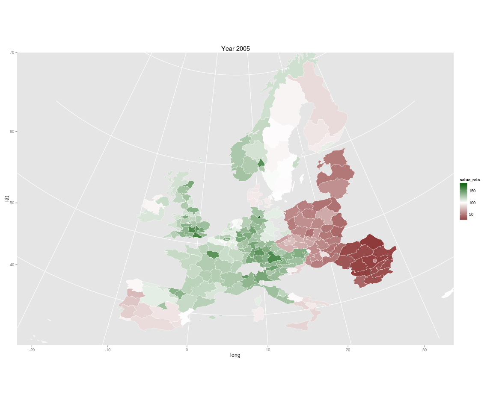
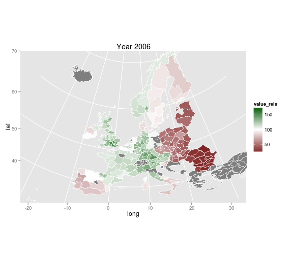
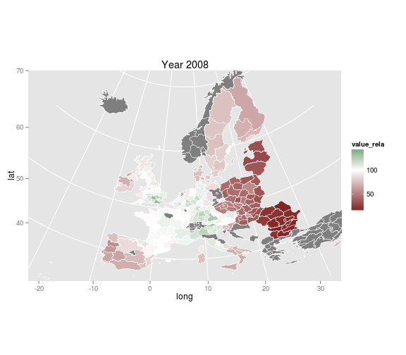
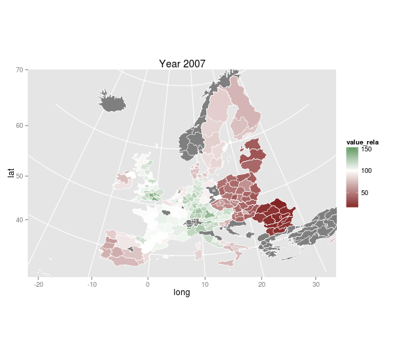
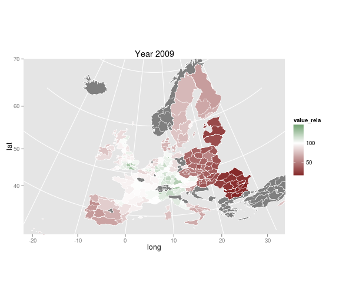
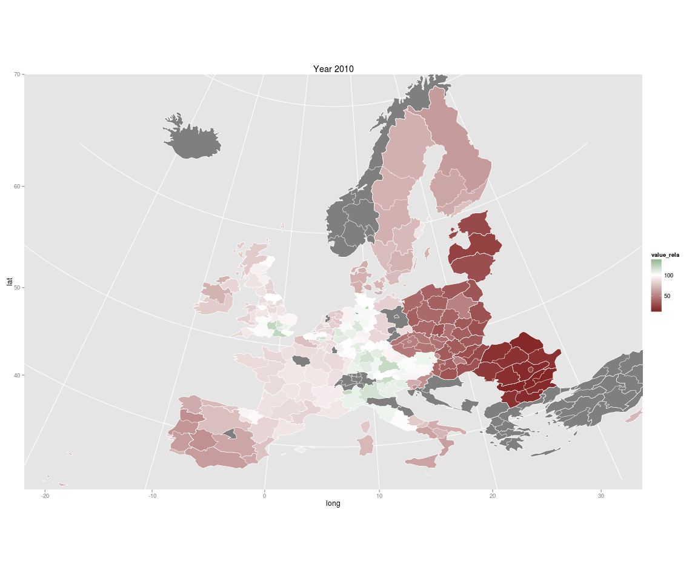

Welfare State and Post-Socialist Transition
==============
css: slides.css
transition: fade
<!--*Theoretical approaches and empirical evidence* -->
 

<a href="http://markuskainu.fi">Markus Kainu</a> 
*PhD student*  
[Aleksanteri institute, University of Helsinki](http://helsinki.fi/aleksanteri)  
[Department of Social Research, University of Turku](https://www.utu.fi/fi/yksikot/soc/yksikot/sosiaalitieteet/Sivut/home.aspx)  

<!-- ---| notes begin |--------------------------------

---------| notes end |-----------------------------  --> 
 

Content
========================================================
incremental: true 

1. Introduction - Central Concepts & Theories of Welfare State
2. Socialist welfare state - the ideal & the reality
3. Characteristics of post-socialist welfare state in figures
4. Conclusions - scenarious for post-socialist welfare state 

========================================================
type: subsection

<h1>1. Introduction   - Central concepts</h1>

Post-socialist transition
========================================================
incremental: true 

- regional: Countries of Former Soviet Union (FSU) and Central and Eastern Europe (CEE)
- temporal: from dissolution of Soviet Union in 1991 until today
- systemic: From socialist planned economy and single-party state with limited civil rights towards  market economy and multi-party democracy with wider civil and political rights

Welfare State
========================================================
incremental: false 

>responsible for guaranteeing the well-being and social rights of it's citizen [(Gösta Esping-Andersen, 1990)](http://books.google.fi/books/about/3_Worlds_of_Welfare_Capitalism.html?id=Vl2FQgAACAAJ&redir_esc=y)

>refers to wide set of state institutions that represent the role of state in ensuring the decent living standards for it's citizens[(Joakim Palme 1990)](http://www.worldcat.org/title/pension-rights-in-welfare-capitalism-the-development-of-old-age-pensions-in-18-oecd-countries-1930-to-1986/oclc/26763202)

>responsible for controlling the inequality of living conditions in a society. Democracy and relatively high level of living standards as a precondition for welfare state. [(Walter Korpi, 1983)](http://books.google.fi/books?id=M-E9AAAAIAAJ&printsec=frontcover&dq=democratic+class+struggle&hl=fi&sa=X&ei=Eh9DUcq9M8WTtQaEtoG4BQ&ved=0CC8Q6AEwAA)

>is used 1) as a synonym for the societys *social sector* as a counter force for the economical sector, 2) to describe systems with *large public sector* and 3) sets of certain social policies. Ringen as well as Walter Korpi have emphasised democracy as a precondition for welfare state. [(Stein Ringen, 1988)](http://journals.cambridge.org/action/displayAbstract?fromPage=online&aid=3309540)

Definitions above are used from research on affluent market economies, whereas in the study of **post-socialist space** the concept of welfare state is used mainly describing the **sectors of public system that redistribute the state funds through social transfers and social services in order to tackle social problems, inequalities and often to ensure the political support of the ruling party.**

Social policy
========================================================
incremental: false 

Some definitions:

>actions that affect the well-being of members of a society through shaping the distribution of and access to goods and resources in that society ([Wikipedia](http://en.wikipedia.org/wiki/Social_policy))

>public policy and practice in the areas of health care, human services, criminal justice, inequality, education, and labor ([The Malcolm Wiener Center for Social Policy at Harvard University](http://www.hks.harvard.edu/centers/wiener))

>an interdisciplinary and applied subject concerned with the analysis of societies' responses to social need. ([The Department of Social Policy at the London School of Economics](http://www.lse.ac.uk/socialPolicy/Home.aspx))

Many other definitions can be found, but on this lecture we can think social policy both 
- as a set of public policies aimed at improving human welfare, and 
- as an academic discipline

What social policies
=======================================

Welfare services
---------------------------------------
- social care
- health care
- child care
- child protection
- old-age care

Welfare transfers
---------------------------------------
- social assistance
- unemployment insurance
- pensions
- family benefits
- student allowances

========================================================
type: subsection

<h1>1. Introduction   - Theories of Welfare State</h1>

Theories of Welfare State
========================================================
incremental: false

Explanatory theories of social welfare have traditionally been divided in two categories ([Aspalter 2008: The welfare state in cross-cultural perspective](http://isw.sagepub.com/content/51/6/777.short))

1. Structural (functional) theories:
-----------------------------------

- are suitable for predicting a convergence on social policies based on common structural determinants such as 
    1. the degree of economic development, 
    2. urbanization, modernization, or 
    3. the advance of capitalist market economy.

The welfare state emerges as part of the ‘logic of industrialisation’, develops in response to the needs of advanced capitalism or that it is a product of modernisation of societies.

Theories of Welfare State
========================================================
incremental: false

2. Actor-based (conflict) theories:    
-----------------------------------
- The welfare state is shaped by struggles over politics and social class.
- suggest that it is the **power and the programs of different actors** that are the key to the formation of welfare regimes. 
- These actors comprise **classes** and **the state**, **corporatist institutions**, **political parties**, **labor unions** and **ruling elites**, as well as **major international bodies** (e.g. IMF, World Bank, UN, OECD). 
- The actor based explanatory theories seem to imply a **diversification of welfare regimes based on different power resources of various actors in particular societies**. 

========================================================
title:false

### 1. Works on Structural (functional) theories

- [Clark Kerr et al.’s (1960) study **Industrialism and Industrial Man**](http://books.google.fi/books?id=QXZEAAAAIAAJ&q=Industrialism+and+Industrial+Man&dq=Industrialism+and+Industrial+Man&hl=fi&sa=X&ei=OjeJULncMOqp4gS5jIHQAQ&ved=0CC4Q6AEwAA)
- [Wilensky (1975) Welfare State and Equality](http://books.google.fi/books?hl=fi&lr=&id=5zaa84FFNLwC&oi=fnd&pg=PR11&dq=The+Welfare+State+and+Equality+%28California,+1975%29&ots=06GKJO0wLT&sig=Ov9mfXQeudviMRyl5j1YtyhxGA8&redir_esc=y#v=onepage&q=The%20Welfare%20State%20and%20Equality%20%28California%2C%201975%29&f=false)
- [Rimlinger (1971) Welfare policy and industrialization in Europe, America, and Russia](http://www.getcited.org/pub/101520226)
- [Myles and Quadagno (2002) Political theories of the welfare state](http://www.jstor.org/discover/10.1086/324607?uid=3737976&uid=2&uid=4&sid=21101305707081)
- [O’Connor (1973) Fiscal Crisis of the State](http://books.google.fi/books?id=onvnIE4WF0wC&printsec=frontcover&dq=O%E2%80%99Connor+Fiscal+Crisis+of+the+State&hl=fi&sa=X&ei=_QBDUaTmH4fHswa50IGoAg&ved=0CDEQ6AEwAA)
- [Flora and Heidenheimer (1981) The development of welfare states in Europe and America](http://www.google.fi/books?hl=fi&lr=&id=ompqRxEt_fwC&oi=fnd&pg=PA1&dq=Flora+and+Heidenheimer+1981&ots=aqxLeA1tDl&sig=MjoHMAhGlThP6dvNTyFxtfONU98&redir_esc=y)

### 2. Works on Actor based (conflict) theories

- [Korpi (1980) Social policy and distributional conflict in the capitalist democracies.](www.jstor.org/stable/10.2307/2095608) 
- [Korpi (1983) The Democratic Class Struggle](http://books.google.fi/books?id=M-E9AAAAIAAJ&printsec=frontcover&hl=fi#v=onepage&q&f=false)
- [Korpi (1989) Power, politics, and state autonomy in the development of social citizenship: Social rights during sickness in eighteen OECD countries since 1930](http://www.tandfonline.com/doi/abs/10.1080/01402388008424288)
- ([Peter Baldwin (1990) The Politics of Social Solidarity, pp. 8–9](http://books.google.fi/books/about/The_Politics_of_Social_Solidarity.html?id=KjVSn1lyurIC&redir_esc=y)). 

Welfare state regimes
========================================================
incremental: false

Since the publication in 1990 of Esping-Andersen’s classic study [The Three Worlds of Welfare Capitalism](http://books.google.fi/books?id=Vl2FQgAACAAJ&dq=he+Three+Worlds+of+Welfare+Capitalism&hl=fi&sa=X&ei=PQVDUYOiBIGatQb5poC4DA&ved=0CDEQ6AEwAA) that the study of welfare state typologies has really taken off. Esping-Andersen presented three models of welfare state:

- **Social-Democratic welfare state** is based on the principle of *universalism* granting access to benefits and services based on citizenship. Social policies are perceived as *politics against the market*. Decommodification is high and stratification low.
- **Christian-democratic welfare states** are based on the principle of *subsidiarity* and the dominance of *social insurance schemes*, offering a medium level of decommodification and a high degree of social stratification.
- **Liberal regime** is based on the notion of *market dominance* and *private provision*. State only interferes to relieve poverty and provide for basic needs on a means-tested basis. The decommodification of state benefits is low and social stratification high ([Ferragina and Seeleib-Kaiser 2011](http://www.ingentaconnect.com/content/tpp/pap/2011/00000039/00000004/art00010)).

Since then the *welfare modelling business* [(Abrahamson, 1999)](http://onlinelibrary.wiley.com/doi/10.1111/1467-9515.00160/pdf) has been booming and this despite Peter Baldwin’s description of typologising as *the lowest form of intellectual endeavour* (1996: 29). 

A non-Western Welfare state typologies
========================================================

- [Nita Rudra](http://www.amazon.com/Globalization-Race-Bottom-Developing-Countries/dp/0521886988) (2006) used the concept of **productivist welfare regime** to characterize the East Asian model and **protectivist** for South Asia. 
- [Gough and Wood (2006)](http://ideas.repec.org/a/eee/wdevel/v34y2006i10p1696-1712.html) proposed the concepts of **informal security regimes** to describe institutional arrangements in developing states, where people rely heavily on community and family relationships to meet their security needs and **insecurity regime**, which perpetuate gross insecurity. For instance, Sub-Saharan shadow states, more or less collapsed, fall in this last category. 
- [Gough and Therborn (2010)](http://personal.lse.ac.uk/goughi/Gough%20Therborn%20final_chapter_47_17.09.2009_10.46.31.pdf), for their part, categorized several post-socialist states as proto-welfare states, which share in common relatively extensive state commitments to welfare provisionand relatively effective delivery of services plus moderately extensive social security programs and superior, in the context of the non-OECD world, welfare outcomes.
- The authors would not suggest that these countries would be necessarily in a way of developing as a *proper* welfare state, but more due to their past socialist arrangements; yet, these old elements are rusting.

Current welfare state thinking -The return of structural theories
========================================================
incremental: false

At the very moment when political theories of the welfare state seemed to have relegated the ‘logic of industrialism’ thesis with its emphasis on the over-determining role of large impersonal economic forces to the critical list, the theory was revived in new form [(Myles and Quadagno, 2002: 41)](http://www.google.fi/url?sa=t&rct=j&q=myles%20and%20quadagno%2C%202002&source=web&cd=1&ved=0CB8QFjAA&url=http%3A%2F%2Frszarf.ips.uw.edu.pl%2Fwelfare-state%2Fmyles.pdf&ei=by2JUPrhFqby4QSF9ICYAw&usg=AFQjCNF_N1eSAklTIQ79WGt5GCtWARnZtQ&cad=rja). 

Globalisation and Deindustrialisation
-------------------------------------------

- [Iversen and Cusack (2000)The Causes of Welfare State Expansion: Deindustrialization or Globalization?](http://journals.cambridge.org/action/displayAbstract?fromPage=online&aid=7660120)

New politics of Welfare
-------------------------------------------

- [Paul Pierson (2001) New politics of the welfare state - book](http://books.google.fi/books/about/The_New_Politics_of_the_Welfare_State.html?id=Je7SNvJVLWQC&redir_esc=y)

Ecological sustainability
-------------------------------------------

- [Max Koch (2011) Climate Change and Capitalism](http://www.palgrave.com/products/title.aspx?pid=413401)

========================================================
type: subsection

<h1>2. Socialist welfare state   - the ideal & the reality</h1>

========================================================

Ideal
---------------------------------------------------

- according to socialist ideology poverty was a problem only in the capitalist system and did not exists in communism
- for that reason the main purpose of social policy was not the reduction of poverty, but social security was redistributed according to categories of people, and poor people/household was not a category
- employment was seen as a primary and only source of livelyhood, and as Lenin wrote "He who does not work shall not eat", in book [The State and Revolution (1917)](http://en.wikipedia.org/wiki/The_State_and_Revolution)
- full emoloyment and minimun wages and pensions set at the level of subsistence minimum were meant to protect citizens from poverty

Reality
---------------------------------------------------

- low income was seen as a problem and two-earners household on minimun wage was a poor household
- durables had to be bought through sociel networks ([blat](http://en.wikipedia.org/wiki/Blat_%28term%29)), shadow economy was widespread
- living conditions we often even better at the countryside due to subsistence farming
- system did quarantee a minimun security, but the wages remained low
- in 1980's employees received 30 % of the GDP as wages, ~60-80 percent in Western countries

In respect to welfare theories
========================================================
incremental: false

- Unlike in developing countries, basic welfare was relatively comprehensive and secure. 
- Unlike in Europe and East Asia, welfare policy was determined by the state rather than democratic/electoral politics. 
- Furthermore, unlike in other regions, welfare provision was concentrated mainly at the enterprise level. 
- The Soviet Union  (and other socialist Eastern European countries as well as China) had a distinct welfare regime, which was constructed on two pillars. 
    - On the one hand, the state provided non-monetary social benefits for particular social groups. 
    - On the other hand, most social benefits and services were based on work, and distributed at on the enterprise level. Firms in such planned economy were not enterprises as is understood in the market economy.
- Both of these old pillars are vanishing away in contemporary market system.

========================================================
type: subsection

<h1>3. Characteristics of post-socialist welfare state in figures</h1>

The effects of the collapse of Soviet Union
========================================================
incremental: false

In 1992-2000

- GDP fell by 38 %
- Industrial production fell by 45 %
- Agricultural production fell by 36 %
- Fixed investment fell by 71 %
- production area of crop, dairy and potato was halved
- proportion of raw materials of exports rose from 66 % to 81 %

New social problems
========================================================
incremental: false

Poverty
----------------------------------------

- in early 1990's 80 % of the people below Soviet Union subsistence minimum
    - new "physiological minimum" was introduced that was half of the previos
    - todays poor is twice as poor as poor in Soviet Union (according to measures)
- decline in real incomes was one reason, widespread wage arrear another
- number of poor people increased from 14 million to nearly 150 million by the mid-1990.

Inequality
-----------------------------------

- In the same period the countries with very equal income distribution experienced a dramatic rose in income inequality resulting in inequality levels similar to Latin American countries. [(Milanovic 1998, 67–71.)](http://papers.ssrn.com/sol3/papers.cfm?abstract_id=156088)
-  In Moldova, the income inequality almost doubled over the first ten years of transition, whereas Belarus remained the most equal country in Europe regarding income distribution [(IMF 2000, 2.)](http://www.imf.org/external/np/prsp/2000/mda/01/)

Unemployment
--------------------------------------
- ~1995 20 % unemployed, 2003 ~9 %
- hidden unemployment ~33 % of workforce in addition to official figures

Current challenges for post-socialist welfare states
==============================================

Demographic challenge
--------------------------------------

- Aging of the population
- Migration

Fiscal challenge
---------------------------------------

- Funding the welfare state?

Democratic challenge?
---------------------------------------

- public support for the welfare state

Soviet legacy challenge
---------------------------------------

- price subsidies and in kind benefits were common in socialist welfare system
    - common in housing and transport
- working poor is wide spread pehnomenon (~80 % of poor household have a working member)
- registers of benefit recipients are lacking or of bad quality

Inequality in terms of social and spatial characteristics
========================================================

 

 Social inequality in EU27-countries using gini-coefficient 2003-2009. (Post-socialist countries with continous line) Source: Eurostat

***
 

 Regional disparities at NUTS2-level in EU27-countries 1995-2007. (Post-socialist countries with continous line) Source: Eurostat

===================================================================

Household incomes relative EU27 median income 2005
--------------------------------------------------------------

 

===================================================================

 

 

***

 

 

================================================================

Household incomes relative EU27 median income 2010
--------------------------------------------------------------

 

Regions of Russia
===================================================================

- [Russian regions (in Finnish)](http://glimmer.rstudio.com/muuankarski/rus_region_fi/)

International comparisons
===============================================

Data from [*Quality of Government Institute*](http://www.qog.pol.gu.se/)

Gadgets
--------------------------------

- [Post-socialist countries in comparison](http://glimmer.rstudio.com/muuankarski/QogCorrPostSoc/)
- [Standard data with all countries](http://glimmer.rstudio.com/muuankarski/QogCorr/)
- [Social Policy data with OECD countries](http://glimmer.rstudio.com/muuankarski/QogCorr/)

========================================================
type: subsection

<h1>4. Conclusions</h1>

Scenarious for post-socialist welfare state development 1
========================================================

*by [János Kovács (2002)](http://www.ingentaconnect.com/content/routledg/wep/2002/00000025/00000002/art00010)*

**First** prediction was widely shared by western social policy experts that the welfare state development would follow none of the continental European or Scandinavian models, but rather the liberal model of United Kingdom or Unites States with means tested benefits and a moderate system of social insurance targeted at low-income households (Esping-Andersen, 1990, 26).

**The second** scenario assumes that the long socialist past will block any consistent and sustained reform effort and as follow-up outcomes can be described by stagnation and strong path dependency. As Kovacs puts it 

>the few relics of the command economy with all its dominant features such as the over-centralization, waste, rationing, shortage, paternalism, rent-seeking and corruption (Kovács, 2002, 192)

Scenarious for post-socialist welfare state development 2
========================================================

*by [János Kovács (2002)](http://www.ingentaconnect.com/content/routledg/wep/2002/00000025/00000002/art00010)*

**The third** alternative poses a mix of corporatist model with additional private elements, a mix of “great variety of small transformations” (Kovács, 2002, 193), rather than a result of a great and consistent reform.

>In this projection welfare states in the central and eastern European member states do not follow any consistent pattern that would converge with one of the three (or four) familiar “welfare regimes” from western and southern Europe; nor can the post-socialist countries be said to have developed a model or “post-socialist” regime of their own.

Scenarious for post-socialist welfare state development
========================================================

*by [Bela Tomka (2006)](http://ceses.cuni.cz/CESES-141-version1-5_2__Tompka_2006_CEE_and_the_European_Social_Model.pdf)*

The newly emerging welfare regimes in East Central Europe do not conform to any of the regime types in Esping-Andersen's typology.

-  Rather, the new welfare systems are a mixture of different elements of these regimes.
-  As a rule there has been no marked convergence to the residual US-type welfare model.
-  The East Central European welfare systems of the 1990s are not close receives of any Western European welfare regime, either.
-  Rather, they mostly mix elements of the social democratic and the conservative regimes.
-  Since there are signs indicating that the future European social model will be based on a merge of the social democratic and conservative welfare models, the welfare development of East Central Europe in the 1990s suggests that the welfare states of the region will converge on that newly formed European social policy model." (Tomka 2006, 155–156)

Current views on post-socialist transition
========================================================

Debate on post-socialist welfare state has intensified lately as two decades of transition has passed

[Offe, Claus. (2009)](http://books.google.fi/books/about/Post_Communist_Welfare_Pathways.html?id=EkZqPgAACAAJ&redir_esc=y) points out two major approaches in that discussion:

1. to what extend institutional path-dependencies from imperial and interwar period have affected the welfare development in post-socialist era
2. to what extend do they encounted path-departures that were conditioned by either a) th ebreakdown of state socialism with the deep crisis and b) the accession of the new members to the European Union and its patterns of capitalist democracy.

One of the most compherensive works is [Tomas Inglot's (2008) Welfare States in East Central Europe](http://books.google.fi/books?id=gXraAAAAMAAJ&dq=Welfare+States+in+East+Central+Europe,+1919-2004&hl=fi&sa=X&ei=zr1DUYnmKMzZsga97oGwBA&ved=0CC8Q6AEwAA) that studies the welfare state development from prewar period until EU accession in Czech, Slovak, Hungary and Poland. 

Inglot comes up with the concept of **emergency welfare state** meaning that political and economical unstability has fuelled temporary welfare reforms, emergency reforms, that have remained and formed a unique institutional layering

Aleksanteri institute - Choices of Russian modernisation
========================================================

Since the collapse of the Soviet Union, socialist welfare structures have experienced rapid, large-scale changes and constant reformulation. Modernisation and institutional reforms have not necessarily proceeded as expected and Russian welfare institutions remain rather weak and of low quality.

**Hypothesis**

1. Because of the lack of democratic (class) struggle the most probable welfare regime in Russia would be a liberal model.
2. The power vertical of the political system enforces state based social policy./ gives elites most power in setting priorities for/ shaping welfare policies
3. Hybrid structure of welfare emerges out of these contradictory tendencies, so that and Russian social policy tends to oscillate between neoliberalism and state based soviet legacy, between individulisation of risks and strong administrative control.
4. Such regime creates contradictory incentives at the micro level of society. Intended outcomes at the macro level may have unintended effects at the micro level and vice versa. *[(see website)](http://www.helsinki.fi/aleksanteri/crm/)*

========================================================
type: subsection

<h1>Thank you</h1>

